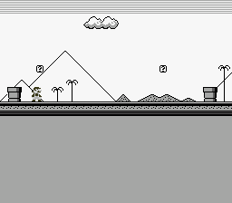

# Slope Mario

This example demonstrates platformer physics with slope collision detection. Mario walks, jumps, and slides along diagonal terrain using the `objCollidMapWithSlopes()` function from the OpenSNES object engine. It combines the map engine (scrolling tiled backgrounds), the object engine (entity management with callbacks), and the dynamic sprite engine (animated character rendering) into a complete platformer framework. No audio -- the focus is on collision mechanics.



## What You'll Learn

- How to use `objCollidMapWithSlopes()` for diagonal terrain collision
- How the OpenSNES object engine manages entities with init/update callbacks
- How map scrolling follows a player object via `mapUpdateCamera()`
- How dynamic sprites handle animation frames with state machines
- How to register object type callbacks from assembly (for correct bank bytes)

## SNES Concepts

### The Map Engine

The OpenSNES map engine handles large scrolling worlds that exceed the 32x32 or 64x64 tile hardware limits. It loads map data from `.m16` files (tilemap), `.t16` files (tile type definitions), and `.b16` files (tile attribute/behavior data). The map is initialized with `mapLoad()` and updated each frame with `mapUpdate()`, which streams new tile columns/rows into VRAM as the camera scrolls. The `mapVblank()` function performs the actual VRAM transfers during VBlank.

### Object Engine and Slope Collision

Each object type has an init callback and an update callback, registered via `objRegisterTypes()`. The engine calls these automatically during `objUpdateAll()`. The key function `objCollidMapWithSlopes()` reads tile attribute data (from `.b16`) to determine which tiles are solid, which are slopes (types `T_SLOPEU1` through `T_SLOPEUD2`), and adjusts the object's Y position to follow diagonal surfaces. The object's `tilestand` field indicates whether the character is on ground -- essential for jump detection.

### Dynamic Sprite Engine

The dynamic sprite engine (`oamInitDynamicSprite`, `oamDynamic16Draw`) manages OAM entries and VRAM tile uploads automatically. Each `oambuffer[]` entry tracks position, current frame ID, and a refresh flag. When `oamrefresh` is set to 1, the engine re-uploads that sprite's tile data to VRAM on the next `oamVramQueueUpdate()` call. This is configured at startup with `oamInitDynamicSprite(0x0000, 0x1000, 0, 0, OBJ_SIZE8_L16)`, placing large sprites at VRAM $0000 and small sprites at $1000.

### Assembly Bank Byte Registration

The compiler produces 16-bit function pointers without bank bytes, but C functions may be placed in bank $01+ by the linker. The `objRegisterTypes()` assembly function uses WLA-DX's `:label` syntax to resolve the correct bank byte at link time, storing the full 24-bit address in the object callback tables (`objfctinit`, `objfctupd`).

## Controls

| Button | Action |
|--------|--------|
| D-PAD Left/Right | Walk left/right (with acceleration up to MARIO_MAXACCEL) |
| A | Jump (hold Up + A for a higher jump) |

## How It Works

**1. Setup** -- The tileset is loaded to VRAM, the map engine is initialized with slope attribute data, and Mario's object type is registered:

```c
bgInitTileSet(0, &tileset, &tilepal, 0,
              (&tilesetend - &tileset), 16 * 2, BG_16COLORS, 0x2000);
bgSetMapPtr(0, 0x6800, SC_64x32);
oamInitDynamicSprite(0x0000, 0x1000, 0, 0, OBJ_SIZE8_L16);
objInitEngine();
objRegisterTypes();
objLoadObjects((u8 *)&objmario);
mapLoad((u8 *)&mapmario, (u8 *)&tilesetdef, (u8 *)&tilesetatt);
```

**2. Mario init callback** -- When the object is created, it sets collision dimensions (width 14, height 16, xofs 1) and loads the sprite graphics and palette:

```c
void marioinit(u16 xp, u16 yp, u16 type, u16 minx, u16 maxx) {
    objWorkspace.width = 14;
    objWorkspace.xofs = 1;
    objWorkspace.height = 16;
    objWorkspace.action = ACT_STAND;
    oambuffer[0].oamframeid = 6;  /* standing frame */
    OAM_SET_GFX(0, &mariogfx);
    dmaCopyCGram(&mariopal, 128, 16 * 2);
}
```

**3. Mario update callback** -- Each frame: read input, apply acceleration, run slope collision, advance the animation state machine, and update the camera:

```c
void marioupdate(u16 idx) {
    pad0 = padHeld(0);
    /* ... apply movement and jump from input ... */
    objCollidMapWithSlopes(idx);  /* slope-aware collision */
    /* Animation state machine: STAND / WALK / JUMP / FALL */
    objUpdateXY(idx);
    oambuffer[0].oamx = mariox - x_pos;
    oambuffer[0].oamy = marioy - y_pos;
    oamDynamic16Draw(0);
    mapUpdateCamera(mariox, marioy);
}
```

**4. Main loop** -- Updates the map, all objects, and flushes sprite/tilemap data to VRAM during VBlank:

```c
while (1) {
    mapUpdate();
    objUpdateAll();
    oamInitDynamicSpriteEndFrame();
    WaitForVBlank();
    mapVblank();
    oamVramQueueUpdate();
}
```

## Project Structure

```
slopemario/
├── main.c          — Console init, map/object setup, main loop
├── mario.c         — Mario init/update callbacks, physics, animation
├── mario.h         — Mario callback prototypes
├── data.asm        — ROM data: tileset, palette, map, object types, bank byte registration
├── Makefile        — Build configuration
└── res/
    ├── tiles.png        — Tileset with slope tiles (4bpp, Mode 1)
    ├── mario_sprite.png — Mario animation frames (16x16, 4bpp)
    ├── BG1.m16          — Map data (tile layout)
    ├── map_1_1.o16      — Object placement data (Mario spawn point)
    ├── map_1_1.t16      — Tile type definitions (solid, slope, empty)
    └── map_1_1.b16      — Tile behavior/attribute data
```

## Build & Run

```bash
cd $OPENSNES_HOME
make -C examples/maps/slopemario
```

Then open `slopemario.sfc` in your emulator (Mesen2 recommended).
