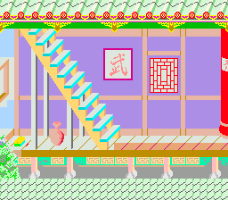

# Tiled Map Editor Integration

This example shows how to use maps created in the [Tiled](https://www.mapeditor.org/) map editor with the OpenSNES map engine. A 224x30 tile level (1792x240 pixels) scrolls horizontally with the D-pad. Only the visible 32-tile window is in VRAM at any time — the map engine streams new columns as the camera moves.



## What You'll Learn

- How to design levels in Tiled and convert them for the SNES
- How the map engine streams a large level through a small VRAM window
- How tile properties (collision, palette, priority) flow from Tiled to the game
- The complete asset pipeline: Tiled → tmx2snes → ROM

## The Tiled Workflow

```
  Tiled Editor              gfx4snes              tmx2snes
┌──────────────┐        ┌──────────────┐      ┌──────────────┐
│ Paint tiles  │        │ tileset.png  │      │ level.tmj    │
│ Set props    │        │      ↓       │      │ + tileset.map│
│ Export .tmj  │        │ .pic .pal .map│     │      ↓       │
└──────┬───────┘        └──────────────┘      │ .m16 .t16 .b16│
       │                                      └──────────────┘
       └── Your level data, ready for mapLoad()
```

**Step 1.** Design your level in Tiled (8x8 pixel tiles, any width/height up to 16384 tiles total). Set per-tile properties: `attribute` (collision), `palette` (0-7), `priority` (0-1).

**Step 2.** Export as `.tmj` (JSON format).

**Step 3.** Convert the tileset image with gfx4snes:
```bash
gfx4snes -s 8 -o 48 -u 16 -p -m -i tileslevel1.png
# Outputs: .pic (tiles), .pal (palette), .map (tile optimization table)
```

**Step 4.** Convert the Tiled map with tmx2snes:
```bash
tmx2snes maplevel01.tmj tileslevel1.map
# Outputs: BG1.m16 (tilemap), maplevel01.t16 (tile defs), maplevel01.b16 (attributes)
```

**Step 5.** Include all binaries in `data.asm` and call `mapLoad()` in your game.

## SNES Concepts

### Map Engine Streaming

The SNES has limited VRAM — a 32x32 tilemap is only 2KB. A 224-tile-wide level won't fit. The map engine solves this by keeping the full level in ROM and streaming only the visible 32-tile window to VRAM:

- `mapLoad()` — copies the full map to extended WRAM (bank $7E), builds lookup tables
- `mapUpdate()` — detects when the camera crosses a tile boundary, prepares column updates
- `mapUpdateCamera()` — sets the camera position (in map pixels)
- `mapVblank()` — DMAs the column updates to VRAM during VBlank

The tilemap lives at VRAM `$6800` with `SC_64x32` layout — this is required by the map engine.

### Tile Properties

Each tile in the Tiled editor can have custom properties:

| Property | Tiled Field | SNES Effect |
|----------|------------|-------------|
| `attribute` | Hex string (e.g., `"FF00"`) | Collision type: `T_SOLID`, `T_LADDER`, `T_SPIKE`, etc. |
| `palette` | Hex string (e.g., `"1"`) | Palette bank (bits 10-12 of tilemap entry) |
| `priority` | Hex string (e.g., `"1"`) | BG priority bit (bit 13 of tilemap entry) |

These are stored in `.b16` (attributes) and `.t16` (palette+priority) files by tmx2snes.

## Controls

| Button | Action |
|--------|--------|
| LEFT   | Scroll camera left |
| RIGHT  | Scroll camera right |

## Project Structure

```
tiled/
├── main.c          — Initialize map engine, scroll with D-pad
├── data.asm        — ROM data includes (.pic, .pal, .m16, .t16, .b16)
├── Makefile        — Build rules with gfx4snes + tmx2snes conversion
└── res/
    ├── tileslevel1.png     — Tileset sprite sheet (source)
    ├── maplevel01.tmj      — Tiled map (JSON, source)
    ├── tileslevel1.pic     — Generated: 4bpp tile graphics
    ├── tileslevel1.pal     — Generated: palette (3 banks × 16 colors)
    ├── tileslevel1.map     — Generated: tile optimization table
    ├── BG1.m16             — Generated: full level tilemap
    ├── maplevel01.t16      — Generated: tile palette+priority
    └── maplevel01.b16      — Generated: tile collision attributes
```

## Modules Used

| Module | Why it's here |
|--------|--------------|
| `console` | `consoleInit()`, `WaitForVBlank()`, NMI handler setup |
| `sprite` | OAM buffer (required by NMI handler) |
| `dma` | DMA transfers for tiles, palette, and map column streaming |
| `input` | `padHeld()` for continuous D-pad reading |
| `background` | BG layer configuration and scroll registers |
| `map` | `mapLoad()`, `mapUpdate()`, `mapVblank()` — the streaming map engine |

## Build & Run

```bash
cd $OPENSNES_HOME
make -C examples/maps/tiled
```

Open `tiled.sfc` in Mesen2 and scroll with LEFT/RIGHT.

## Making Your Own Level

1. Install [Tiled](https://www.mapeditor.org/) (free, cross-platform)
2. Create a new map: 8x8 pixel tiles, any width up to ~200 tiles
3. Import your tileset PNG and paint your level
4. Add tile properties (`attribute`, `palette`, `priority`) in the tileset editor
5. Export as `.tmj`
6. Update the Makefile with your filenames
7. `make clean && make`

The map engine handles the rest — streaming, scrolling, collision lookups via `mapGetMetaTilesProp()`.
