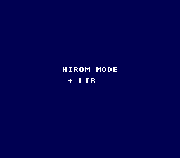

# HiROM Demo -- Understanding SNES Memory Mapping



## What This Example Shows

The difference between **LoROM** and **HiROM** memory mapping on the SNES, and how
to build a HiROM ROM with OpenSNES. The program displays "HIROM MODE" and changes
the background color when A is pressed -- proving the ROM, library, and input all
work correctly in HiROM mode.

## Prerequisites

Read `text/hello_world` first (basic PPU setup). Understanding of hexadecimal
addressing is helpful but not required.

## Controls

| Button | Action |
|--------|--------|
| A (hold) | Changes background to light blue |

## Build & Run

```bash
cd $OPENSNES_HOME
make -C examples/memory/hirom_demo
```

Then open `hirom_demo.sfc` in your emulator (Mesen2 recommended).

## How It Works

### 1. Enable HiROM in the Makefile

```makefile
USE_HIROM = 1
```

This tells the build system to:
- Use `hdr_hirom.asm` instead of `hdr.asm` for the ROM header
- Set the mapping mode byte to HiROM
- Adjust the linker configuration for 64 KB banks

### 2. The code is identical to LoROM

The C code does not need to change between LoROM and HiROM -- the compiler and
linker handle the address mapping transparently. `consoleInit()`, `dmaCopyVram()`,
`padHeld()` -- everything works the same way.

### 3. Embedded font (no external assets)

This demo uses a built-in 2bpp font defined as a `const` array in C:

```c
static const u8 font_tiles[] = { ... };
```

The `const` qualifier places the data in ROM (not RAM), so it works regardless
of memory mapping mode. The tiles are loaded to VRAM via `dmaCopyVram()`.

### 4. Interactive feedback

```c
if (pressed & KEY_A) {
    REG_CGADD = 0;
    REG_CGDATA = 0x00; REG_CGDATA = 0x7C;  /* Light blue */
} else {
    REG_CGADD = 0;
    REG_CGDATA = 0x00; REG_CGDATA = 0x28;  /* Dark blue */
}
```

The color change on A-press confirms that joypad reading works correctly in
HiROM mode. CGRAM writes at $2121/$2122 work identically in both modes.

## SNES Concepts

### LoROM vs HiROM

| | LoROM | HiROM |
|------|-------|-------|
| Bank size | 32 KB ($8000-$FFFF) | 64 KB ($0000-$FFFF) |
| ROM range | Banks $00-$7D | Banks $C0-$FF |
| Max size | ~4 MB | ~4 MB |
| WRAM access | Banks $00-$3F, $80-$BF | Banks $00-$3F |

- **LoROM**: Each bank only exposes the upper 32 KB of ROM. The lower half
  ($0000-$7FFF) maps to hardware registers, WRAM, etc. Most SNES games use LoROM.
- **HiROM**: Each bank exposes the full 64 KB of ROM. This makes large data tables
  simpler to address (no bank-boundary splits). Used by games with large assets
  (Chrono Trigger, Star Ocean).

### When to Use HiROM

- Large contiguous data (> 32 KB tilesets, music, maps)
- Simpler address math for streaming systems
- If you do not need it, stick with LoROM -- it is the default and better tested

### Address Translation

The key difference is where ROM data appears in the CPU address space. In LoROM,
a 64 KB ROM file is split across two banks (bank 0 holds bytes 0-32767 at
$8000-$FFFF, bank 1 holds bytes 32768-65535). In HiROM, the same data fills
one bank completely ($0000-$FFFF). The linker and ROM header handle this mapping
automatically.

## Project Structure

| File | Purpose |
|------|---------|
| `main.c` | Embedded font, text display, input-driven color change |
| `Makefile` | `USE_HIROM := 1`, `LIB_MODULES := console dma input sprite background` |

## Going Further

- **Compare ROM sizes**: Build the same example in LoROM (remove `USE_HIROM=1`) and
  compare the `.sfc` file sizes and `.sym` file bank assignments.

- **Large data test**: Create a `const` array larger than 32 KB and verify it loads
  correctly in HiROM. In LoROM, this would require bank-crossing logic.

- **Explore related examples**:
  - `memory/save_game` -- SRAM persistence (works in both LoROM and HiROM)
  - `games/likemario` -- A larger project that benefits from understanding memory layout
