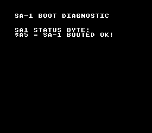

# SA-1 Hello World

> SA-1 boot diagnostic -- verifies coprocessor initialization



## Build & Run

```bash
cd $OPENSNES_HOME
make -C examples/memory/sa1_hello
```

Then open `sa1_hello.sfc` in your emulator (Mesen2 recommended).

## What You'll Learn

- SA-1 coprocessor cartridge type detection
- I-RAM shared memory between SNES CPU and SA-1
- SA-1 boot status codes and diagnostics
- Using `USE_SA1 := 1` in the Makefile

## Status Codes

| Value | Meaning |
|-------|---------|
| `$A5` | SA-1 booted successfully |
| `$FF` | I-RAM access failure |
| `$00` | SA-1 timeout (never responded) |
| `$42` | I-RAM not cleared (self-test stuck) |

## Modules Used

| Module | Purpose |
|--------|---------|
| console | System initialization |
| sprite | OAM management |
| dma | DMA transfers |
| background | BG configuration |
| text | Diagnostic text display |
| input | Joypad reading |
| sa1 | SA-1 coprocessor driver |
