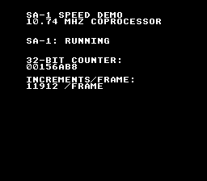

# SA-1 Speed Demo

> SA-1 coprocessor 10.74 MHz counter demonstration



## Build & Run

```bash
cd $OPENSNES_HOME
make -C examples/memory/sa1_speed
```

Then open `sa1_speed.sfc` in your emulator (Mesen2 recommended).

## What You'll Learn

- SA-1 runs at 10.74 MHz vs the main CPU's 3.58 MHz (3x faster)
- Shared I-RAM communication between SNES CPU and SA-1
- Reading a 32-bit counter updated continuously by the coprocessor
- Measuring SA-1 throughput in increments per frame

## What to Observe

- The 32-bit hex counter increments extremely fast (millions per second)
- The "increments per frame" display shows SA-1 throughput
- This speed is impossible on the main 3.58 MHz CPU alone

## Modules Used

| Module | Purpose |
|--------|---------|
| console | System initialization |
| sprite | OAM management |
| dma | DMA transfers |
| background | BG configuration |
| text | Counter and status display |
| input | Joypad reading |
| sa1 | SA-1 coprocessor driver |
