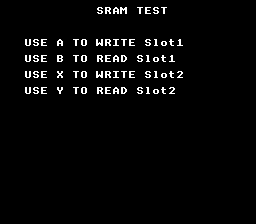

# Save Game -- SRAM Persistence



## What This Example Shows

How to save and load game data using the SNES cartridge SRAM (Static RAM). The SRAM
is battery-backed -- data persists even when the console is powered off. This is how
classic SNES games like Zelda and Final Fantasy save progress.

## Prerequisites

Read `text/hello_world` first (console setup, text display).

## Controls

| Button | Action |
|--------|--------|
| A | Write test data to Slot 1 |
| B | Read and display Slot 1 |
| X | Write test data to Slot 2 |
| Y | Read and display Slot 2 |

## Build & Run

```bash
cd $OPENSNES_HOME
make -C examples/memory/save_game
```

Then open `save_game.sfc` in your emulator (Mesen2 recommended).

## How It Works

### 1. Define a save structure

```c
typedef struct {
    s16 posX, posY;
    u16 camX, camY;
} SaveState;
```

The structure is 8 bytes. In a real game, this would hold player position, inventory,
level progress, etc.

### 2. Save to SRAM

```c
sramSaveOffset((u8 *)&vts, SAVE_SIZE, SAVE_SIZE * SLOT1);
```

`sramSaveOffset()` copies `SAVE_SIZE` bytes from RAM to SRAM at the given offset.
Multiple save slots use different offsets (Slot 0 at offset 0, Slot 1 at offset 8, etc.).

### 3. Load from SRAM

```c
sramLoadOffset((u8 *)&vtl, SAVE_SIZE, SAVE_SIZE * SLOT1);
```

`sramLoadOffset()` copies bytes back from SRAM into a RAM structure. The loaded
values are then displayed as hex on screen using `textPrintHex()`.

### 4. Enable SRAM in the Makefile

```makefile
USE_SRAM = 1
SRAM_SIZE = 3
```

`USE_SRAM` sets the ROM header flag telling the emulator (or real hardware) that the
cartridge has battery-backed SRAM. `SRAM_SIZE = 3` means 8 KB (2^3 = 8 KB).

### 5. Text display

The example uses the text system on BG1 in Mode 0 (2bpp):

```c
textInit();
textLoadFont(0x0000);
bgSetGfxPtr(0, 0x0000);
bgSetMapPtr(0, 0x3800, BG_MAP_32x32);
```

After each save/load operation, `textPrintAt()` updates the on-screen feedback and
`textFlush()` sends the updated text buffer to VRAM.

## SNES Concepts

### SRAM Address Space

In LoROM mode, SRAM is mapped at `$70:0000-$71:FFFF` (up to 64 KB, though most
cartridges have 8 KB). In HiROM mode, it appears at `$20:6000-$3F:7FFF`. The
`sramSaveOffset()` and `sramLoadOffset()` functions handle the addressing -- you
just provide a byte offset.

### Save Slots

Save slots are simply offsets into SRAM. With 8 KB of SRAM and 8-byte saves, you
could theoretically have 1024 slots. Real games use 3-4 slots with larger structures
(100-500 bytes for RPG save states).

### Checksum Validation

This example does not validate saves. A real game should store a checksum alongside
the save data to detect corrupted SRAM (weak battery, first boot with uninitialized
RAM, etc.). A simple XOR or CRC-8 of the save bytes suffices.

### Battery Persistence

On real SNES hardware, a CR2032 lithium battery in the cartridge powers the SRAM
when the console is off. Batteries last 15-25 years. In emulators, the SRAM is
saved to a `.srm` file on disk.

## Project Structure

| File | Purpose |
|------|---------|
| `main.c` | Save/load logic, text display, input handling |
| `Makefile` | `USE_SRAM := 1`, `LIB_MODULES := console dma text background sprite input` |

## Going Further

- **Add a checksum**: Before saving, compute a checksum of the data bytes and store
  it alongside the save. On load, verify the checksum and display "CORRUPT" if it
  does not match.

- **Larger save structure**: Add fields for health, inventory, level number, and
  play time. This is how real RPG save systems work.

- **Explore related examples**:
  - `memory/hirom_demo` -- Understand LoROM vs HiROM memory mapping
  - `games/breakout` -- See game state management in a complete game
