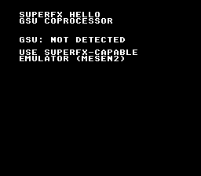

# SuperFX Hello

> GSU coprocessor boot diagnostic with SRAM tests and FMULT validation



## Emulator Compatibility

| Emulator | Status |
|----------|--------|
| **bsnes** | Recommended -- cycle-accurate SuperFX |
| **Mesen2** | Works (minor DMA timing differences) |
| **snes9x** | Detected with cart type $13 |

> **Note:** opensnes-emu (snes9x-based) shows "GSU: NOT DETECTED" because snes9x WASM does not emulate the SuperFX coprocessor.

## Build & Run

```bash
cd $OPENSNES_HOME
make -C examples/memory/superfx_hello
```

Then open `superfx_hello.sfc` in bsnes (recommended).

## What You'll Learn

- Detecting the SuperFX (GSU) coprocessor via the VCR register
- Launching a GSU program and reading back R0 ($CAFE)
- SRAM shared memory: byte writes ($42, $55) and word write via STW ($BEEF)
- FMULT instruction validation (2*2 = $4000, 1.5*3 = $4800)
- WRAM stub execution (CPU cannot read ROM while GSU owns the bus)

## Modules Used

| Module | Purpose |
|--------|---------|
| `console` | System initialization |
| `sprite` | OAM setup (required by consoleInit) |
| `dma` | DMA transfers |
| `background` | BG configuration |
| `text` | Diagnostic text display |
| `superfx` | GSU detection and communication |
