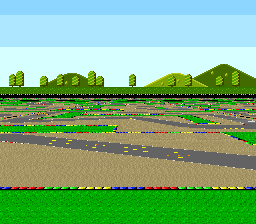

# DSP-1 Ground — the Super Mario Kart floor



`mode7/perspective` fakes a receding floor with a precomputed M7A/M7D table.
This example asks the DSP-1 for the real thing: every frame the coprocessor's
**Raster** command streams one Mode 7 matrix per scanline — A, B, C *and* D —
for the camera you describe with `dsp1Parameter`, and two HDMA channels replay
them the next frame. Turn with the D-pad and the whole floor rotates in true
perspective, because the rotation is inside the matrices the chip computed.

This is the technique Super Mario Kart and Pilotwings shipped with — the
reason the DSP-1 was on the cartridge at all.

## How it works

1. `dsp1Parameter(x, y, height, lfe, les, heading, tilt)` describes the
   camera and hands back four numbers: **Vof** (raster of the "imaginary
   centre"), **Vva** (horizon raster, relative to Vof), and **Cx/Cy** — the
   ground point under that centre, which goes straight to M7X/M7Y.
2. `dsp1Raster(ab, cd, Vva + 2, lines)` streams the per-raster matrices for the
   ground below the horizon into two buffers laid out as
   `HDMA_MODE_2REG_2X` repeat payloads (M7A/M7B on one channel, M7C/M7D on the
   other). Raster `Vva+1` is the singular horizon line, so the ground starts at
   `Vva+2` on screen line `112 + Vof + Vva + 2`.
3. Two more HDMA channels do the F-Zero split above the horizon (BGMODE 3 +
   BG2 sky, then BGMODE 7 + BG1 ground) exactly like `mode7/perspective`.
4. The tables are double-buffered: the DSP-1 fills the back set during active
   display (≈ 50 µs per raster, 126 rasters ≈ 40 % of the frame), and VBlank
   swaps them with `hdmaSetTable` and moves M7X/M7Y and the Mode 7 scroll so
   the ground under the imaginary centre stays pinned to the middle of the
   screen.

Moving forward uses the chip too: `dsp1Triangle(heading, speed)` gives the
sin/cos step on the ground plane.

## Controls

| Button | Action |
|--------|--------|
| D-pad Left / Right | Turn the camera (the floor rotates) |
| D-pad Up / Down | Drive forward / backward along the heading |

## SNES Concepts

- DSP-1 Raster: an open-ended command that streams until the CPU writes the
  `$8000` sentinel in place of a D read (the lib does this for you)
- Parameter outputs (Vof, Vva, Cx, Cy) as the whole screen geometry
- HDMA `2REG_2X` repeat blocks feeding two Mode 7 registers per channel
- Double-buffered HDMA tables swapped in VBlank
- Mid-frame BG mode switch (sky above, Mode 7 below)

## How to Build

```bash
make
```

The ROM needs a DSP-1 on the cartridge (`USE_DSP1 := 1` sets the header) and
luna needs Sony's `dsp1b.rom` firmware installed once
(`luna state --dsp1-rom <path> dsp1_ground.sfc`); the luna test manifest is
firmware-gated and skips cleanly in CI.

## Modules Used

console, dma, background, input, mode7, hdma, dsp1 (auto-added by `USE_DSP1`)

## Project Structure

| File | Purpose |
|------|---------|
| `main.c` | Camera, DSP-1 calls, HDMA tables, double buffering |
| `data.asm` | Ground (Mode 7) and sky (Mode 3) assets in `ASSET_SECTION` |
| `res/ground.png`, `res/sky.png` | Textures shared with `mode7/perspective` (PVSnesLib Mode7Perspective, mills32 / alekmaul) |

## Going Further

- `dsp1Target(h, v)` is the inverse: which ground point is under a screen
  pixel — the missile scope of Pilotwings, a cursor on the track.
- Change `CAM_AZS` (tilt) and watch Vof/Vva move the horizon; keep the ground
  under 127 rasters per repeat block, or call `dsp1Raster` twice for two blocks.
- `chips/dsp1_cube` — the other half of the chip: Attitude / Objective /
  Project for objects on top of this floor.
