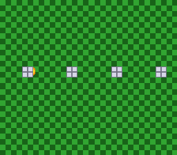

# Mode 7 EXTBG

> One Mode 7 plane split into two layers by bit 7 of its pixels, with a
> sprite passing between them.



SETINI bit 6 (EXTBG) gives Mode 7 a BG2 that shows the same plane as BG1
but reads bit 7 of every pixel as a priority bit. Here the floor's pixels
have bit 7 clear and the pillars' have it set, so the ball — a priority-1
sprite — rolls over the floor and behind the pillars of one single plane.
Press **A** to switch EXTBG off: BG1 is shown instead, one layer, and the
ball covers the pillars too.

## Build & Run

```bash
cd $OPENSNES_HOME
make -C examples/mode7/extbg
```

Open `extbg.sfc` in luna (or any SNES emulator) and press A.

## SNES Concepts

- **SETINI ($2133) bit 6**, Mode 7 EXTBG, through `mode7SetExtBg()` (the
  lib keeps a shadow of the write-only register, shared with the other
  SETINI setters)
- **EXTBG priority**, front to back: sprites 3, sprites 2, BG2 pixels with
  bit 7 set, sprites 1, BG1, sprites 0, BG2 pixels with bit 7 clear
  (anomie's register doc, *Mode 7*) — hence BG2 alone on the main screen
- **One pixel, two colours**: BG2 reads bits 0-6, BG1 all eight, so the
  pillar's `0x83` is colour 3 on BG2 and colour 131 on BG1 (both loaded
  with the same grey)
- **Mode 7 at 1:1**: `mode7SetScale(0x0200)` — the lib's matrix is half
  the scale — and `mode7SetScroll(0, 0)` to put plane row 0 on the first
  line
- **The plane built at run time**: a 16 KB tilemap in a `FAR` buffer, three
  8bpp tiles, `dmaCopyVramMode7()` for the interleaved upload; the ball
  drawn as pixels and encoded with `tileEncode4bpp()`

## What You'll See

- A green checkerboard floor with a row of grey pillars; the yellow ball
  rolls left and right, hidden behind each pillar as it passes.
- **A**: EXTBG off — the ball is drawn over the pillars. **A** again: back.

## Testing

`tools/luna-test/manifests/mode7_extbg.toml` checks SETINI ($40 / $00 /
$40) and the main-screen designation across two A presses, the 1:1 matrix
and the scroll, and that the ball moves. The visual baselines capture the
occlusion.

## Modules Used

| Module | Purpose |
|--------|---------|
| `console` | System initialization, `WaitForVBlank` |
| `dma` | Mode 7 VRAM upload, palettes, sprite tiles |
| `sprite` | The ball (OAM) |
| `input` | The A button |
| `mode7` | Matrix, scroll, `mode7SetExtBg()` |
| `tile` | The ball's tiles, built from pixels |
