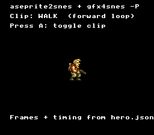

# Aseprite Pipeline



An animated 32×48 hero metasprite whose **every byte of data is generated from a
single Aseprite project** — no hand-written frame tables, no hand-typed
animation clips. This is the working reference for the two-tool sprite pipeline:

```
hero.aseprite ─┬─ gfx4snes -P    → hero.pic/.pal + res/hero_meta.inc
               │                   (tiles, palette, metasprite pointer table)
               └─ aseprite2snes  → res/hero_anim.h
                                   (one AnimClip per Aseprite tag)
```

`gfx4snes` owns the pixels and the metasprite geometry; `aseprite2snes` owns the
timeline (tags, per-frame durations, direction). They meet at the frame value: a
clip's frame *i* selects `hero_metasprites[i]`, resolved inline by
`animTickMeta()` and drawn with `oamDrawMeta()`.

The artist authored two tags in Aseprite — **walk** (forward loop) and **wave**
(ping-pong) — with per-frame millisecond durations. `aseprite2snes` converted
those to ticks and folded the ping-pong into the frame order. Press **A** to
toggle between the two generated clips.

## SNES Concepts

- Metasprite composition from multiple OAM entries (`oamDrawMeta`)
- The `anim.h` player driving a metasprite via `animTickMeta()`
- Machine-generated metasprite table (`gfx4snes -P`) + animation clips (`aseprite2snes`)
- OBJSEL size mode and OBJ VRAM base for 16×16 hardware sprites
- Sprite palette at CGRAM 128 (`OBJ_CGRAM_BASE`)

## How to Build

```sh
cd examples/sprites/aseprite_pipeline && make
```

The build runs the full pipeline automatically: `gfx4snes -P` on `res/hero.png`
and `aseprite2snes` on `res/hero.json`, then compiles `main.c` (which `#include`s
both generated files).

## Modules Used

`console`, `sprite`, `dma`, `text`, `text4bpp`, `background`, `input`, `anim`

## See Also

- `tools/aseprite2snes` — the animation-clip generator (`docs/tools/aseprite2snes.md`)
- `tools/gfx4snes` — the tile/palette/metasprite generator (`-P`)
- `examples/sprites/metasprite` — hand-authored metasprite composition
- `examples/sprites/animated_sprite` — single-sprite frame animation
