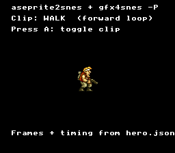

# Aseprite Pipeline



An animated 32×48 hero metasprite whose **every byte of data is generated from a
single Aseprite project** — no hand-written frame tables, no hand-typed
animation clips. This is the working reference for the two-tool sprite pipeline:

```
hero.aseprite ─┬─ res/hero.png  + hero.png.toml  → opensnes-sprite sheet → hero.pic/.pal + hero_meta.inc
               │                                    (tiles, palette, metasprite pointer table)
               └─ res/hero.json + hero.json.toml → opensnes-sprite anim  → hero_anim.h
                                                    (one AnimClip per Aseprite tag)
```

`sheet` owns the pixels and the metasprite geometry; `anim` owns the
timeline (tags, per-frame durations, direction). They meet at the frame value: a
clip's frame *i* selects `hero_metasprites[i]`, resolved inline by
`animTickMeta()` and drawn with `oamDrawMetasprite()`.

The artist authored two tags in Aseprite — **walk** (forward loop) and **wave**
(ping-pong) — with per-frame millisecond durations. `opensnes-sprite anim` converted
those to ticks and folded the ping-pong into the frame order. Press **A** to
toggle between the two generated clips.

## SNES Concepts

- Metasprite composition from multiple OAM entries (`oamDrawMetasprite`)
- The `anim.h` player driving a metasprite via `animTickMeta()`
- Machine-generated metasprite table (`opensnes-sprite sheet --metasprite`) + animation clips (`opensnes-sprite anim`)
- OBJSEL size mode and OBJ VRAM base for 16×16 hardware sprites
- Sprite palette at CGRAM 128 (`OBJ_CGRAM_BASE`)

## How to Build

```sh
cd examples/sprites/aseprite_pipeline && make
```

The build runs the full pipeline from the two settings files beside the
assets (`res/hero.png.toml`, `res/hero.json.toml`): `opensnes-sprite sheet`
and `opensnes-sprite anim`, then the generated `assets_gen.asm` links the
tiles, then `main.c` compiles (it `#include`s both generated headers). No
`data.asm`, no conversion rule in the Makefile (`docs/tools/CONVENTIONS.md`).

## Modules Used

`console`, `sprite`, `dma`, `text`, `text4bpp`, `background`, `input`, `anim`

## See Also

- `tools/opensnes-sprite` — sheets, metasprites and Aseprite clips (`docs/tools/opensnes-sprite.md`)
- `examples/sprites/metasprite` — hand-authored metasprite composition
- `examples/sprites/animated_sprite` — single-sprite frame animation
