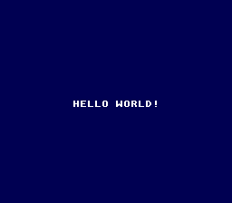

# Hello World

> Your first SNES ROM. Nine tiles, two colors, one message. Welcome to 1990.



## Build & Run

```bash
make -C examples/text/hello_world
# Open hello_world.sfc in Mesen2
```

## What You'll Learn

- How the SNES turns pixels into pictures (tiles, tilemaps, palettes — the holy trinity)
- Why you can't just `printf("HELLO WORLD")` on a Super Nintendo
- What "2 bits per pixel" actually means when you're staring at hex bytes
- The difference between VRAM (video memory) and regular RAM

---

## Walkthrough

### 1. There Is No printf

On a modern computer, printing text is one line of code. On the SNES, there is no
text system. There's no font. There's no framebuffer. The PPU (Picture Processing Unit)
only understands one thing: **tiles**.

A tile is an 8x8 pixel image stored in VRAM. A tilemap is a grid that says "put tile #3
here, tile #7 there." That's it — that's the entire display system. If you want letters
on screen, you need to draw each letter as a tile, upload them to VRAM, and then write
a tilemap that spells out your message.

That's exactly what this example does.

### 2. Drawing Letters in Hex

Each letter is hand-encoded as a 16-byte tile in 2bpp format (2 bits per pixel = 4 possible
colors). Every pair of bytes is one row of 8 pixels:

```c
static const u8 font_tiles[] = {
    /* Tile 1: H */
    0x66, 0x00, 0x66, 0x00, 0x66, 0x00, 0x7E, 0x00,
    0x66, 0x00, 0x66, 0x00, 0x66, 0x00, 0x00, 0x00,
    /* ... */
};
```

Take `0x66` = binary `01100110`. Each `1` is a lit pixel, each `0` is background.
Draw it out and you'll see two vertical bars — the sides of the letter H.
The `0x7E` row (`01111110`) is the crossbar.

> **Why are all the second bytes `0x00`?** In 2bpp format, byte 1 is bitplane 0
> and byte 2 is bitplane 1. We only use color 1 (bitplane 0 = 1, bitplane 1 = 0),
> so the second byte is always zero. If you set both to `0xFF`, you'd get color 3
> instead. That's how the SNES packs multiple color choices into minimal memory.

### 3. Setting Up the PPU

Before writing anything to VRAM, you need to tell the PPU where to find things:

```c
consoleInit();
setMode(BG_MODE0, 0);

REG_BG1SC = 0x04;    /* Tilemap at VRAM $0400, 32x32 entries */
REG_BG12NBA = 0x00;  /* BG1 tile graphics at VRAM $0000 */
```

Mode 0 gives you four background layers, each with 4 colors (2bpp). For a simple
text display, one layer is plenty. `BG1SC = 0x04` tells the PPU "the tilemap for
BG1 starts at VRAM word address `$0400`", and `BG12NBA = 0x00` says "the actual tile
graphics start at `$0000`."

> **Why two separate addresses?** Because tiles and tilemaps are different data.
> Tiles are the pixel art. The tilemap is the layout — which tile goes where on
> screen. They can live anywhere in VRAM, and you choose where by setting these
> registers. This separation is what makes the SNES so flexible: you can reuse
> the same tiles with different layouts, or swap layouts without reloading tiles.

### 4. Uploading Tiles to VRAM

VRAM isn't regular memory — you can't just write to it with a pointer. You talk to it
through a pair of registers: set the address, then write data byte by byte:

```c
REG_VMAIN = 0x80;   /* Auto-increment after writing high byte */
REG_VMADDL = 0x00;  /* Target: VRAM $0000 */
REG_VMADDH = 0x00;

for (i = 0; i < 144; i += 2) {
    REG_VMDATAL = font_tiles[i];      /* Low byte */
    REG_VMDATAH = font_tiles[i + 1];  /* High byte → address increments */
}
```

VRAM is organized in 16-bit words. `VMAIN = 0x80` means "auto-increment the address
after I write the high byte." So you write low, write high, and the address moves
forward by one word. 144 bytes = 9 tiles × 16 bytes each = our complete font.

### 5. Two Colors, Four Bytes

The SNES palette uses 15-bit BGR color (5 bits per channel, little-endian):

```c
REG_CGADD = 0;       /* Start at color 0 */
REG_CGDATA = 0x00;   /* Color 0 low:  dark blue */
REG_CGDATA = 0x28;   /* Color 0 high: dark blue */
REG_CGDATA = 0xFF;   /* Color 1 low:  white */
REG_CGDATA = 0x7F;   /* Color 1 high: white */
```

Color 0 is the background, color 1 is the text. Four bytes, two colors. That's all
we need for a monochrome font.

### 6. Spelling the Message

The message is encoded as an array of tile indices:

```c
static const u8 message[] = {
    1, 2, 3, 3, 4,  /* HELLO */
    0,               /* space */
    5, 4, 6, 3, 7,  /* WORLD */
    8,               /* ! */
    0xFF             /* end marker */
};
```

Tile 1 = H, tile 2 = E, tile 3 = L, and so on. To place this at row 14, column 10,
we calculate the tilemap address:

```c
addr = 0x05CA;  /* 0x0400 (tilemap base) + 14×32 + 10 */
REG_VMADDL = addr & 0xFF;
REG_VMADDH = addr >> 8;

i = 0;
while (1) {
    tile = message[i];
    if (tile == 0xFF) break;
    REG_VMDATAL = tile;  /* Tile number */
    REG_VMDATAH = 0;     /* Attributes: palette 0, no flip */
    i++;
}
```

Each tilemap entry is 2 bytes: the low byte picks the tile, the high byte holds
attributes (palette, flip, priority). We set them all to 0 — palette 0, no flipping.

> **What's `0x05CA`?** The tilemap base is `$0400`. Each row is 32 entries wide.
> Row 14 starts at `$0400 + 14×32 = $0400 + $01C0 = $05C0`. Column 10 adds 10
> more: `$05CA`. That math becomes second nature after a few tilemaps.

### 7. Lights On

```c
REG_TM = TM_BG1;  /* Show BG1 on the main screen */
setScreenOn();     /* Turn on the display */

while (1) {
    WaitForVBlank();
}
```

`TM` (screen designation) controls which layers are visible. We enable BG1 only.
`setScreenOn()` sets brightness to maximum. The infinite loop with `WaitForVBlank()`
keeps the program alive and synced to 60fps — without it, the CPU would spin wildly
and cause timing issues.

---

## Tips & Tricks

- **Screen is black?** Check that `REG_TM` has the right layer enabled. If BG1 isn't
  in the TM register, the PPU won't draw it, no matter what's in VRAM.

- **Tiles look wrong?** Count your bytes. 2bpp = 16 bytes per tile. If your array is
  off by even one byte, every subsequent tile shifts and you get garbage.

- **Want to understand 2bpp better?** Take the `0x66` byte and draw it on graph paper.
  Binary: `01100110`. Mark the 1s. Do all 8 rows of the H tile. You'll see the letter
  form before your eyes.

- **Why `setMode(BG_MODE0, 0)` and not Mode 1?** Mode 0 gives 4 layers of 2bpp (4 colors
  each). Mode 1 gives 2 layers of 4bpp + 1 layer of 2bpp. For monochrome text,
  Mode 0 is the natural fit — and you get 3 extra layers free if you want them later.

---

## Go Further

- **Change the message:** Add tiles for your own letters. Each tile is 16 bytes — sketch
  it on graph paper first, convert to hex, add it to `font_tiles[]`.

- **Add color:** Set bitplane 1 to non-zero values in your tile data and add more
  colors to the palette. Color 2 uses bitplane 1 only, color 3 uses both bitplanes.

- **Two lines of text:** Write a second message at a different tilemap row. Row N starts
  at base address + N×32.

- **Next example:** [Custom Font](../custom_font/) — a complete A-Z, 0-9 font with
  reusable text rendering.

---

## Under the Hood: The Build

### The Pipeline

```
main.c  →  cc65816  →  main.c.asm  →  wla-65816  →  main.c.obj  →  wlalink  →  hello_world.sfc
  C          cproc+       65816          WLA-DX         object        linker       final ROM
source       QBE         assembly       assembler        file
```

`cc65816` is the C compiler — it's actually two programs stitched together: `cproc` (a C11
frontend) parses your C code into intermediate representation, then `QBE` (with a custom
65816 backend) turns that IR into assembly. `wla-65816` assembles it into an object file.
Finally, `wlalink` links everything — your compiled code, the startup code (crt0.asm),
math helpers (runtime.asm), and library modules — into a playable `.sfc` ROM.

### The Makefile

```makefile
TARGET      := hello_world.sfc          # Output ROM filename
ROM_NAME    := OPENSNES HELLO WORLD     # 21-char name burned into the ROM header
USE_LIB     := 1                        # Link against the OpenSNES library
LIB_MODULES := console sprite dma       # Which library pieces to pull in
CSRC        := main.c                   # Your single C source file
```

One key rule: **OpenSNES supports only one C source file per project.** That's `CSRC`.
If your project grows, you either `#include` other `.c` files into main.c, or add
additional logic as assembly files via `ASMSRC`.

### Why These Modules?

| Module | Why it's here |
|--------|--------------|
| `console` | Provides `consoleInit()` and `WaitForVBlank()`. Sets up Mode 1, the NMI handler, and basic PPU config. |
| `sprite` | OAM buffer management. Even with no sprites on screen, the NMI handler DMAs the OAM buffer every frame — if the sprite module is missing, the linker can't find the buffer symbols. |
| `dma` | Provides `dmaCopyVram()` and `dmaCopyCGram()`. Without it, you'd write tile data byte-by-byte through registers (which we actually do in this example, but the library's init code uses DMA internally). |

> **"But there are no sprites in Hello World!"** Correct. The dependency chain is:
> `console` → `sprite` → `dma`. The NMI handler (in console) always DMAs the OAM buffer
> (in sprite) to the PPU, and that DMA call lives in the dma module. The build system
> does NOT auto-resolve these dependencies — if you forget `dma`, you get a linker error
> about an undefined `dmaCopyOam` symbol and no hint about why.

---

## Technical Reference

| Register | Address | Role in this example |
|----------|---------|---------------------|
| BGMODE   | $2105   | Mode 0 (4 layers, all 2bpp) |
| BG1SC    | $2107   | BG1 tilemap at $0400 |
| BG12NBA  | $210B   | BG1 tile data at $0000 |
| VMAIN    | $2115   | VRAM auto-increment mode |
| VMADDL/H | $2116-17 | VRAM write address |
| VMDATAL/H | $2118-19 | VRAM data port |
| CGADD    | $2121   | Palette address |
| CGDATA   | $2122   | Palette data |
| TM       | $212C   | Enable BG1 on main screen |

## Files

| File | What's in it |
|------|-------------|
| `main.c` | Everything — tiles, palette, tilemap, main loop (~136 lines) |
| `Makefile` | `LIB_MODULES := console sprite dma` |
