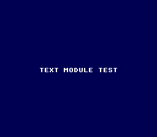

# Text Module Test

A minimal validation test for the OpenSNES text module. It initializes the text
system, loads the built-in font, prints a single string to the screen, and halts.
The expected result is a dark blue screen with "TEXT MODULE TEST" displayed in
white. This example serves as a diagnostic: if the text module is broken, this is
the simplest program that will reveal it.



## What You'll Learn

- How to initialize the text rendering system (`textInit`, `textLoadFont`)
- How to configure BG tile and tilemap pointers for text display
- How to set CGRAM colors for background and text
- The correct call sequence: init, load font, set pointers, print, flush

## SNES Concepts

### Text Rendering on the SNES

The SNES has no text hardware. To display text, you need a font stored as
background tiles in VRAM and a tilemap that maps ASCII characters to tile
indices. The text module handles this: `textLoadFont()` uploads a built-in 8x8
font to a specified VRAM address, and `textPrintAt()` writes character tile
indices into a RAM buffer. `textFlush()` then DMA's that buffer into the
BG1 tilemap in VRAM.

### CGRAM and Color Setup

The SNES PPU reads colors from CGRAM (Color Generator RAM), a 512-byte palette
holding 256 15-bit colors. Color 0 is the universal backdrop color. For text,
you need at minimum two colors: color 0 for the background and color 1 for the
font pixels. `setColor()` writes a 15-bit BGR value to a specific CGRAM index.
The `RGB(r, g, b)` macro converts 5-bit red, green, blue components into the
SNES 15-bit format ($0BBBBBGGGGGRRRRR).

### BG Pointer Configuration

The PPU needs to know where in VRAM to find the tilemap and tile graphics for
each background layer. `bgSetMapPtr(0, 0x3800, BG_MAP_32x32)` tells the PPU
that BG1's tilemap starts at VRAM word address $3800 and uses a 32x32 tile
layout (256x256 pixels). `bgSetGfxPtr(0, 0x0000)` sets the tile character data
address. These must match where `textLoadFont()` placed the font tiles.

## Controls

This example has no interactive controls. It displays a static text string.

## How It Works

### 1. Console and Video Mode

Initialize the system and set Mode 0 (4 background layers, 2bpp each). Mode 0
is ideal for text because 2bpp tiles use less VRAM and 4 colors per palette
slot is sufficient for monochrome text.

```c
consoleInit();
setMode(BG_MODE0, 0);
```

### 2. Set Colors

Color 0 (backdrop) is set to dark blue ($2800) and color 1 (font) to white.
`setMainScreen(LAYER_BG1)` enables BG1 on the main screen so the tilemap is
visible.

```c
setColor(0, 0x2800);
setColor(1, RGB(31, 31, 31));
setMainScreen(LAYER_BG1);
```

### 3. Initialize Text and Load Font

`textInit()` sets up internal buffers. `textLoadFont()` uploads the built-in
font tiles to VRAM $0000. The BG pointers are then configured to match:

```c
textInit();
textLoadFont(0x0000);
bgSetGfxPtr(0, 0x0000);
bgSetMapPtr(0, 0x3800, BG_MAP_32x32);
```

### 4. Print and Flush

`textPrintAt(8, 14, "TEXT MODULE TEST")` writes tile indices to a RAM buffer
at column 8, row 14. `textFlush()` DMA's this buffer to the tilemap in VRAM.
The screen is then enabled:

```c
textPrintAt(8, 14, "TEXT MODULE TEST");
textFlush();
WaitForVBlank();
setScreenOn();
```

### 5. Idle Loop

The program enters an infinite loop calling `WaitForVBlank()`. The text remains
on screen because the tilemap in VRAM is static.

## Project Structure

```
text_test/
├── main.c      — Text module initialization, print, and flush
└── Makefile    — Build configuration (4 library modules: console, dma, text, background)
```

## Build & Run

```bash
cd $OPENSNES_HOME
make -C examples/text/text_test
```

Then open `text_test.sfc` in your emulator (Mesen2 recommended). You should see
"TEXT MODULE TEST" in white on a dark blue background. If the screen is solid
dark blue with no text, there is a bug in `textPrintAt` or `textFlush`. If the
screen is black, the program crashed.
